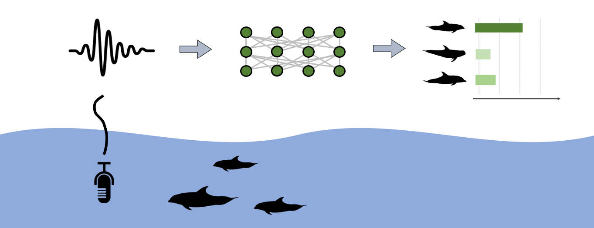

## Identify dolphin species acoustically with machine learning.
This repository contains code for developing and applying machine learning models for identifying delphinid species by acoustic characteristics of their vocalizations. Models are designed to be used in conjunction with the open-source acoustic analysis software [PAMGuard](https://www.pamguard.org/), while interested developers are welcome to suggest alterations or additions to any code.

## How it works
Classifier models provided here are designed to work in a two-stage process: **base classifiers** classify individual delphinid vocalizations, or short segments containing multiple successive vocalizations, to species based on acoustic characteristics of either whistles or echolocation clicks. The output of the base whistle and click classifiers, which are lists of probabilities of classification for each species based on each vocalization, or each segment of vocalizations, and is then fed into an **event classifier**, which integrates predictions across the two base classifiers, synthesizing information from whistles and clicks across the entire event. This approach was motivated by the *BANTER* classification method outlined in [1]. We developed two separate methods for base classification of whistles and clicks, for which sub-repositories containing code and further information are linked below.

### which.dolphin/

> #### └── [delphinID](https://github.com/tristankleyn/which.dolphin/tree/main/delphinID)/
> delphinID models are convolutional neural networks (CNNs) developed in TensorFlow and trained to classify species by latent characteristics in concatenated normalised frequency power spectra of whistles or clicks. 

> #### └── [rocca](https://github.com/tristankleyn/which.dolphin/tree/main/rocca)/
> [ROCCA](https://www.pamguard.org/rocca/rocca.html) (Real-time Odontocete Call Classification Algorithm) ([Oswald et al., 2007](https://pubs.aip.org/asa/jasa/article/122/1/587/813007)) models are Random Forest models developed in WEKA and trained to classify species based on select acoustic-temporal measurements extracted from whistles or clicks.

> #### └── [eventClassifier](https://github.com/tristankleyn/which.dolphin/tree/main/eventClassifier)/
> Folder containing simple graphical user interface developed in R _Shiny_, which allows users to integrate predictions from whistle and click classifiers (either ROCCA or delphinID) with an event classifier model to form final species predictions for isolated acoustic events.

## References
[1] Rankin, S., Archer, F., Keating, J.L., Oswald, J.N., Oswald, M., Curtis, A. and Barlow, J., 2017. Acoustic classification of dolphins in the California Current using whistles, echolocation clicks, and burst pulses. Marine Mammal Science, 33(2), pp.520-540.

