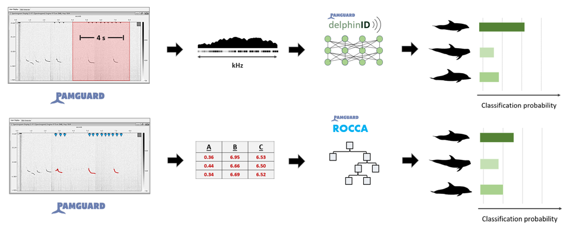

## Identify dolphin species acoustically through machine learning.

This is a repository containing two workflows for training and evaluating machine learning classifiers to recognise dolphin species by the characteristics of their acoustic vocalizations, specifically their echolocation clicks and  tonal whistles. Code for each workflow, one that uses Random Forest analysis with targeted acoustic measurements and another that uses deep learning with raw spectral data from vocalizations, is available in sub-folders of the repository:

### which.dolphin/

#### └── [delphinID](https://github.com/tristankleyn/which.dolphin/tree/main/delphinID)/

delphinID is a deep learning workflow for training and testing classifiers to recognise species based on averaged spectral profiles of whistles and clicks

#### └── [rocca](https://github.com/tristankleyn/which.dolphin/tree/main/rocca)/

[ROCCA](https://www.pamguard.org/downloads.php?cat_id=5) (Real-time Odontocete Call Classification Algorithm) ([Oswald et al., 2007](https://pubs.aip.org/asa/jasa/article/122/1/587/813007)) is a method for classifying dolphin vocalizations to species using select measurements with Random Forest analysis. This folder contains code to train and test models using this method.

