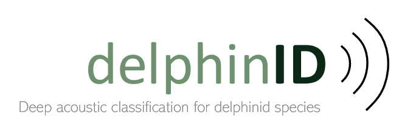

##
This repository contains code for training and testing delphinID models, convolutional neural networks designed to accurately identify delphinid species by latent features in the frequency spectra of their echolocation click and whistle vocalizations, detected from passive acoustic recordings using [PAMGuard](https://www.pamguard.org/) software. Code is available in the following scripts:

##

### delphinID/

> #### └── [classify_main.py](https://github.com/tristankleyn/which.dolphin/blob/main/delphinID/classify_main.py)
> Python script for training, evaluating, and exporting delphinID models. 

> #### └── [classify_functions.py](https://github.com/tristankleyn/which.dolphin/blob/main/delphinID/classify_functions.py)
> Python script containing functions required for classify_main script

> #### └── [compiledata_main.R](https://github.com/tristankleyn/which.dolphin/blob/main/delphinID/compiledata_main.R)
> R script for extracting features from PAMGuard detections and preparing data in format required for training and evaluating models.

> #### └── [compiledata_functions.R](https://github.com/tristankleyn/which.dolphin/blob/main/delphinID/compiledata_functions.R)
> R script containing functions required for compiledata_main script

##

### Learn about delphinID
> #### 🧾 [Overview](#overview)
> #### 🔧 [DIY: Make your own delphinID classifier](#diy-train-a-delphinid-classifier-for-your-dataspecies)
> #### 🌎 [Pre-trained classifiers for northeast Atlantic delphinids](#pre-trained-classifiers-for-northeast-atlantic-delphinid-species)
> #### 💡 [FAQ's](#faqs)

##
##

### 🧾 Overview

delphinID models are convolutional neural networks trained to accurately classify delphinid species by latent characteristics in the average low-frequency spectra of their whistle and click vocalizations, calculated across 4-second windows we term detection frames. Thus, delphinID classification is not based on spectrogram representations but rather compressed spectra averaged across successive vocalizations - this has benefits both in terms of computational efficiency when models are run within [PAMGuard](https://www.pamguard.org/) and in terms of the models' robustness to overfitting. For the delphinID classifiers we have developed, detections of whistles and clicks were automatically extracted in PAMGuard and calculation of detection frames was done using the R package [PAMPal] (https://taikisan21.github.io/PAMpal/), while the delphinID models themselves were trained in Tensorflow 2.18. Interested developers are welcome to use other methods to detect vocalizations and calculate detection frames, though we recommend at least loosely following our methods to achieve similar results. 

##

### 🔧 DIY: Train a delphinID classifier for your data/species

Scripts contained in this folder can be used to train and test your own delphinID classifiers. The necessary stages for doing so include generating delphinID-compatible inputs, which are spectral characterisations of groups of whistle or click detections we refer to as "detection frames", and training and evaluating delphinID (CNN) models to classify species present in your data. Follow the steps outlined below to train your own models and please get in touch if you have further questions.

1. Make sure the latest versions of [R](https://cran.r-project.org/) and [Python](https://www.python.org/downloads/) are installed on your device.

2. Clone or download this repository to your device
   `git clone https://github.com/tristankleyn/which.dolphin.git`
   

3. Detect whistle and click vocalizations in passive acoustic recordings. Support for running automatic detectors in PAMGuard can be found [here](https://www.pamguard.org/tutorials/getstarted.html), though classifiers can in theory be trained with data from any software.

   
    
   <em>PAMGuard display showing bearings, waveforms, and spectra of click detections in passive acoustic data.</em>

4. Generate detection frame examples from whistle and click detections. [compiledata_main.R](https://github.com/tristankleyn/which.dolphin/blob/main/delphinID/compiledata_main.R) and its functions [compiledata_functions.R](https://github.com/tristankleyn/which.dolphin/blob/main/delphinID/compiledata_functions.R) can be used to generate detection frames for detections made in PAMGuard. Other software or custom methods can alternatively be used to generate detection frames. All detection frames to should be saved into .csv files within ./delphinID/data - this is done automatically when using the scripts provided.

   
    
   <em>Detection frames represent average frequencies present in detections within 4-second time windows.</em>

5. Train and evaluate classifier models using [classify_main.py](https://github.com/tristankleyn/which.dolphin/blob/main/delphinID/classify_main.py) and its functions [classify_functions.py](https://github.com/tristankleyn/which.dolphin/blob/main/delphinID/compiledata_functions.R). All examples in each unique encounter will form a separate testing set for evaluating a new classifier trained on all other encounters in the dataset, while models and results are exported to ./delphinID/data. Classification parameters used in the "classify_main.py" script, which are described in the table below, can be adjusted to achieve optimal results.

   
    
   <em>Classifiers are iteratively trained and tested using cross validation across all unique encounters in the dataset.</em>

6. Save your classifiers in "saved_model" format to upload into and use within the PAMGuard Deep Learning module.

#### Adjustable classification hyperparameters
| Parameter | Default | Description |
|-----------------|-----------------|-----------------|
| nmin | 3 | Minimum threshold for the number of clicks per detection frame to be used for classification |
| dd | (0.1, 100) | Minimum and maximum detection density of whistle detection frames to be used for classification |
| nmax | 30 | Maximum number of examples per encounter used for training |
| batch_size | 1 | Number of examples used for training before retraining internal model parameters |
| epochs | 20 | Number of training epochs for each bootstrap of training and validation data |
| partitions | 5 | Number of different partitions/bootstraps of training and validation data to train model on | 
| seed | 42 | Initial random seed for training |
| use_selectencs | False | Use custom list of select encounters for training |
| omit | [] | Custom list of select encounters to omit from training and testing |
| split | 0.33 | Proportion of training data used for validation in each training epoch |
| model_format | 'saved_model' | 'saved_model' or '.keras' format for saving CNN models |

#### Additional hyperparameters (recommended to be kept at default settings)
| Parameter | Default | Description |
|-----------------|-----------------|-----------------|
| resize | 1 | Factor to compress input arrays by (i.e. factor of 2 halves array length) | Compressing input arrays reduces training time/computational expense |
| nfiltersconv | 16 | Number of filters used in 1D convolutional layers in CNN model |
| kernelconv | 3 | Size of filters, or kernels, used in 1D convolutional layers in CNN model |
| padding | 'same' | Zero-pad input features to match output size of 1D convolutional layer in CNN model |
| maxpool | 2 | Size of sliding window for max pooling layer in CNN model |
| densesize | 10 | Size of dense layer in CNN model | 
| dropout | 0.2 | Proportion of neurons randomly discarded by dropout in each training step |
| patience | 20 | Number of epochs before early stopping callback during model training |

##

### 🌎 Pre-trained classifiers for northeast Atlantic delphinid species 
Trained models for northeast Atlantic delphinid species are available [here](https://zenodo.org/records/14578299?preview=1), along with further information and suggested citations. On average, the northeast Atlantic delphinID classifier predicts events containing 1 or more vocalizations with an accuracy of 86.3% (90% CI 82.5-90.1%) across seven species common to this region, ranging in average accuracy from 80% for short-beaked common dolphins to 92% for white-beaked dolphins, while discarding an average of 24.4% of classifications as ambiguous. F1 score (recall x precision) is shown for each species below:

##### Average performance of the northeast Atlantic event classifier (F1 score = accuracy x precision)
<table>
  <tr>
    <td></td>
    <td></td>
    <td colspan="3"><b>F1 score (events)</b></td>
  </tr>
  <tr>
    <td><b>Species name</b></td>
    <td><b>Species name</b></td>
    <td><b>Whistles only</b></td>
    <td><b>Clicks only</b></td>
    <td><b>Whistles and clicks</b></td>
  </tr>
  <tr>
    <td>Short-beaked common dolphin</td>
    <td><i>Delphinus delphis</i></td>
    <td>0.20</td>
    <td>0.60</td>
    <td>0.50</td>
  </tr>
  <tr>
    <td>Risso's dolphin</td>
    <td><i>Grampus griseus</i></td>
    <td>0.11</td>
    <td>0.80</td>
    <td>0.70</td>
  </tr>
  <tr>
    <td>Long-finned pilot whale</td>
    <td><i>Globicephala melas</i></td>
    <td>0.14</td>
    <td>0.46</td>
    <td>0.65</td>
  </tr>
  <tr>
    <td>Atlantic white-sided dolphin</td>
    <td><i>Lagenorhynchus acutus</i></td>
    <td>0.37</td>
    <td>---*</td>
    <td>0.58</td>
  </tr>
  <tr>
    <td>White-beaked dolphin</td>
    <td><i>Lagenorhynchus albirostris</i></td>
    <td>0.54</td>
    <td>0.86</td>
    <td>0.90</td>
  </tr>
  <tr>
    <td>Killer whale</td>
    <td><i>Orcinus orca</i></td>
    <td>0.57</td>
    <td>---*</td>
    <td>0.80</td>
  </tr>
  <tr>
    <td>Common bottlenose dolphin</td>
    <td><i>Tursiops truncatus</i></td>
    <td>0.20</td>
    <td>0.45</td>
    <td>0.81</td>
  </tr>
  <tr>
    <td><b>All species</b></td>
    <td></td>
    <td><b>0.30</b></td>
    <td><b>0.57</b></td>
    <td><b>0.76</b></td>
  </tr>
</table>
*Not included in classifier due to data insufficiency  

##

### 💡 FAQ's
#### ❓ What exactly is a detection frame?

Detection frames are representations of the average frequency content in detections of clicks or whistles contained within a 4-second time window and are the input features used by delphinID classifier models. To train the northeast Atlantic delphinID classifiers, detection frames were produced for clicks and whistles in slightly different ways. Average frequency power spectra for individual clicks were calculated using the R package PAMpal (https://taikisan21.github.io/PAMpal/) [1] and then averaged together for all click detections within 4-second time windows and normalised to form detection frames. Whistle detection frames were instead calculated as arrays of the relative density of frequency values within detected whistle peak frequency contours. While limitations of our dataset restricted us to training our classifiers on low frequency spectra of clicks (10-40 kHz) and whistles (2-20 kHz), detection frames can be characterised across any desired frequency range. One main benefit of using a detection-based approach over one using spectrogram images as input is that a majority of the information contained in the input is relevant to our signals of interest, so long as detections of signals are accurate and of high signal-to-noise ratio. Training classifiers on inputs that are largely robust to background noise is likely to benefit their performance and generalisability. 

#### ❓ Why don't detection frames utilise a wider frequency bandwidth?

Our models were trained to classify species based on acoustic characteristics in the 2-20 kHz range for whistles and in the 10-40 kHz range for clicks - these ranges were limited by the number of recordings at different sampling rates which were available to us. Delphinid clicks can contain energy up to frequencies above 150 kHz, while whistles and their harmonic structures often contain energy higher than 20 kHz. While the pre-trained classifiers for the northeast Atlantic are bound to low-frequency characterisations of whistles and clicks, new delphinID models could be trained using other bandwidths and this may be useful provided sufficient data at higher sampling rates.

#### ❓ What settings should I use for detecting signals in PAMGuard?

Detailed support and tutorials for using automatic detectors in PAMGuard can be found at (www.pamguard.org). For training accurate classifiers, users should target whistles and clicks of high signal-to-noise ratio that are unmasked by other loud sound sources. Certain settings within automatic detectors, such as trigger thresholds, trigger filters, and spectral criteria can be used to filter detections.

### References
[1] Sakai, T., 2020. PAMpal: Load and process passive acoustic data. R package version 0.9, 14.

