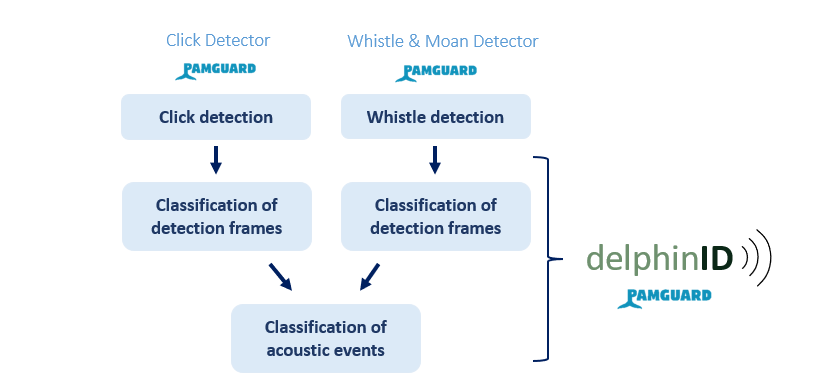
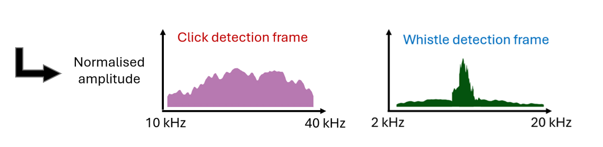

##
This repository contains code for training and testing delphinID models, convolutional neural networks designed to accurately identify delphinid species by latent features in the frequency spectra of their echolocation click and whistle vocalizations, detected from passive acoustic recordings using [PAMGuard software](https://www.pamguard.org/). Code is available in the following scripts:

### delphinID/

#### └── [classify_main.py](https://github.com/tristankleyn/which.dolphin/blob/main/delphinID/classify_main.py)
Python script for training, evaluating, and exporting delphinID models. 

#### └── [classify_functions.py](https://github.com/tristankleyn/which.dolphin/blob/main/delphinID/classify_functions.py)

Python script containing functions required for classify_main script

#### └── [compiledata_main.R](https://github.com/tristankleyn/which.dolphin/blob/main/delphinID/compiledata_main.R)

R script for extracting features from PAMGuard detections and preparing data in format required for training and evaluating models.

#### └── [compiledata_functions.R](https://github.com/tristankleyn/which.dolphin/blob/main/delphinID/compiledata_functions.R)

R script containing functions required for compiledata_main script

## Using pre-trained classifiers for Northeast Atlantic delphinid species 
Trained models for classifying recordings of seven northeast Atlantic delphinid species (Short-beaked common dolpins _(Delphinus delphis)_, Common bottlenose dolphins _(Tursiops truncatus)_, Risso's dolphins _(Grampus griseus)_, Atlantic white-sided dolphins _(Lagenorhynchus acutus)_, white-beaked dolphins _(Lagenorhynchus albirostris)_, killer whales _(Orcinus orca)_, and long-finned pilot whales _(Globicephala melas)_) are available and citable for use [here](https://zenodo.org/records/14578299?preview=1).

The northeast Atlantic delphinid classifier predicts events with an average accuracy of 86.3% (90% CI 82.5-90.1%) across the seven species, ranging from 80% accuracy for short-beaked common dolphins to 92% for white-beaked dolphins. F1 score (accuracy x precision) is shown for each species below:

**Northeast Atlantic classifier performance (F1 score = accuracy x precision)**
| Species | Event, whistles only | Event, clicks only | Event, whistles and clicks |
|-----------------|-----------------|-----------------|-----------------|
| Delphinus delphis | 0.20 | 0.60 | 0.50 |
| Grampus griseus | 0.11 | 0.80 | 0.70 |
| Globicephala melas | 0.14 | 0.46 | 0.65 |
| Lagenorhynchus acutus | 0.37 | --- | 0.58 |
| Lagenorhynchus albirostris | 0.54 | 0.86 | 0.90 |
| Orcinus orca | 0.57 | --- | 0.80 |
| Tursiops truncatus | 0.20 | 0.45 | 0.81 |
| **All species** | **0.30** | **0.57** | **0.76** |

## Train your own delphinID classifiers
The R and Python scripts described above can be used to train and test your own delphinID classifier models through the following steps:

1. Make sure the latest versions of ([R](https://cran.r-project.org/)) and ([Python](https://www.python.org/downloads/)) are installed on your device.

2. Clone or download this repository to your device
   `git clone https://github.com/tristankleyn/which.dolphin.git`
   

4. Detect whistle and click vocalizations in passive acoustic recordings. Support for running automatic detectors in PAMGuard can be found [here](https://www.pamguard.org/tutorials/getstarted.html), though classifiers can be trained with data from any software.

   
    
   <em>PAMGuard display showing bearings, waveforms, and spectra of click detections in passive acoustic data.</em>

6. Generate detection frame examples from whistle and click detections. [compiledata_main.R](https://github.com/tristankleyn/which.dolphin/blob/main/delphinID/compiledata_main.R) and its functions [compiledata_functions.R](https://github.com/tristankleyn/which.dolphin/blob/main/delphinID/compiledata_functions.R) can be used to generate detection frames for detections made in PAMGuard. Other software or custom methods can alternatively be used to generate detection frames. All detection frames to should be saved into .csv files within ./delphinID/data - this is done automatically when using the scripts provided.

   
    
   <em>Detection frames represent average frequencies present in detections within 4-second time windows.</em>

8. Train and evaluate classifier models using [classify_main.py](https://github.com/tristankleyn/which.dolphin/blob/main/delphinID/classify_main.py) and its functions [classify_functions.py](https://github.com/tristankleyn/which.dolphin/blob/main/delphinID/compiledata_functions.R). All examples in each unique encounter will form a separate testing set for evaluating a new classifier trained on all other encounters in the dataset, while models and results are exported to ./delphinID/data. Classification parameters used in the "classify_main.py" script, which are described in the table below, can be adjusted to achieve optimal results.

   
    
   <em>Classifiers are iteratively trained and tested using cross validation across all unique encounters in the dataset.</em>

#### Adjustable classification hyperparameters
| Parameter | Default | Description |
|-----------------|-----------------|-----------------|
| nmin | 3 | Minimum threshold for the number of clicks per detection frame to be used for classification |
| dd | (0.1, 100) | Minimum and maximum detection density of whistle detection frames to be used for classification |
| nmax | 30 | Maximum number of examples per encounter used for training |
| batch_size | 1 | Number of examples used for training before retraining internal model parameters |
| epochs | 20 | Number of training epochs for each bootstrap of training and validation data |
| partitions | 5 | Number of different partitions/bootstraps of training and validation data to train model on | 
| seed | 42 | Initial random seed for training |
| use_selectencs | False | Use custom list of select encounters for training |
| omit | [] | Custom list of select encounters to omit from training and testing |
| split | 0.33 | Proportion of training data used for validation in each training epoch |
| model_format | 'saved_model' | 'saved_model' or '.keras' format for saving CNN models |

#### Additional hyperparameters (recommended to be kept at default settings)
| Parameter | Default | Description |
|-----------------|-----------------|-----------------|
| resize | 1 | Factor to compress input arrays by (i.e. factor of 2 halves array length) | Compressing input arrays reduces training time/computational expense |
| nfiltersconv | 16 | Number of filters used in 1D convolutional layers in CNN model |
| kernelconv | 3 | Size of filters, or kernels, used in 1D convolutional layers in CNN model |
| padding | 'same' | Zero-pad input features to match output size of 1D convolutional layer in CNN model |
| maxpool | 2 | Size of sliding window for max pooling layer in CNN model |
| densesize | 10 | Size of dense layer in CNN model | 
| dropout | 0.2 | Proportion of neurons randomly discarded by dropout in each training step |
| patience | 20 | Number of epochs before early stopping callback during model training |

## User manual
### Terminology
| Term | Description |
|-----------------|-----------------|
| Accuracy | The proportion of correct (out of total) predictions made by a classifier.  |
| Bandwidth | A range of frequencies (Hz) |
| Broadband | Containing a wide range of frequencies (Hz) |
| Click | Broadband pulse signal used by dolphins for echolocation |
| Detection frame | A 2D representation of PAMGuard detections containing one or more vocalizations. Peak-frequency contours are plotted across frequency (Hz, vertical axis) and time (sec, horizontal axis) to represent whistles in whistle detection frames. Average normalised power spectra are plotted across proportion of energy (vertical axis) and frequency (Hz, horizontal axis) in click detection frames. |
| Encounter | A period of time containing one or more dolphin vocalizations. Independent encounters are spatiotemporally separate from one another (at least 1 hour or 5 km apart). | 
| Narrowband | Containing a narrow range of frequencies (Hz) | 
| Nyquist frequency | The maximum frequency (Hz) that can be detected (half the sampling rate) | 
| Sampling rate | The frequency (Hz) at which audio samples are recorded | 
| Spectrogram | A 2D representation of sound showing the frequency (Hz, vertical axis) and amplitude (colour intensity) of sound over time (sec, horizontal axis) | 
| Whistle | A narrowband signal used by dolphins for social communication. |

#### Principles of Operation 
There are four main stages to classifying acoustic events with delphinids using delphinID.
##### 1)	Detect echolocation clicks
##### 2)	Detect narrowband whistle fragments
##### 3)	Classification of detection frames (using whistles and clicks separately)
##### 4)	Classification of events (using whistles and clicks together)

delphinID models are convolutional neural networks developed in TensorFlow for classifying dolphin vocalizations to species. The current models available are tested for classifying seven species found in the northeast Atlantic Ocean. The models classify spectral profiles of 4-seconds of either click or whistle fragments detected in PAMGuard to predict species identity. These profiles are normalised 1-dimensional arrays representing the average frequency power spectra of all detections within a 4-second window. 

Acoustic representations of clicks and whistle fragments, which are made separately and herein referred to as detection frames, are normalised arrays containing the average frequency power spectra of all whistle fragments or clicks detected within a rolling 4-second window. The delphinID click and whistle models predict species identity based on these frames and predictions are accumulated over time to inform an overall prediction for a given acoustic event.

##### What is a detection frame?
Detection frames are the units of classification used by delphinID, representing the average frequency power spectra of either whistles or clicks detected across a 4-second time window. For whistles, spectra are calculated between 2-20 kHz while for clicks spectra range from 10-40 kHz. Higher frequencies may contain information that could improve classification but were not used due to the high proportion of available training data that were restricted in sampling rate to 96 kHz or below and also due to interferring noise sources across several data sources between 40-48 kHz. The frequency ranges selected thus represented a range where useful information pertaining to the frequency content of whistles and clicks could be reliably extracted from detections and used to train delphinID models. A benefit of using detection frames over spectrogram images, which have been traditionally used for machine learning classification problems in acoustics, is that 100% of the information contained in a detection frame is relevant to the signals of interest. While the influence of background noise is difficult to prevent entirely, this technique significantly limits it compared with spectrogram-based approaches. As mentioned previously, automated whistle contour extraction algorithms such as the Whistle & Moan Detector in PAMGuard are known to produce fragemented detections, often missing a significant portion of a whistle contour. A benefit of using detection frames as classification features over parameters measured from individual whistles, as has been done extensively in previous classification studies, is that the average frequency power spectra of whistle across 4-second windows is relatively robust across different degrees of fragmentation compared with individual whistle measurements. 

### Configuring supporting PAMGuard modules
#### a) Click Detector
Click detections made using the PAMGuard Click Detector (REF) are used as input for delphinID’s click classification. The Click Detector module identifies likely echolocation clicks by monitoring energy level changes in frequency bands over time (REF). As the delphinID click classifier was trained on thousands of verified, high signal-to-noise ratio click detections, it is the responsibility of the user to ensure accurate click detection. This is only possible through use of appropriate Click Detector settings, of which there are many. There are several ways to improve click detection (see PAMGuard Help menu), three of which are described below:

**Pre-filters and trigger filters help to focus detection on the frequency band of interest.** For training the delphinID click model, an IIR Butterworth high-pass filter was used for pre-filtering and trigger filtering. A fourth-order high-pass was set at 500 Hz for pre-filtering, while a second-order high pass was set at 2000 Hz for trigger filtering.

**A high trigger threshold can be used to eliminate false positive detections.** While this can often result in missed detections, it increases the likelihood of detections being true. A conservative minimum trigger threshold of +20 dB was used to filter detections used to train and evaluate the delphinID model.

**Classifying clicks based on spectral properties helps to distinguish noise from biological signals.** Clicks of the seven species targeted by delphinID for classification all contain a high proportion of energy between 15 and 120 kHz. Limited by the sampling rates of the recordings in the dataset available, delphinID only analyses spectral properties up to 40 kHz. We thus used a simple click classification scheme to filter out detections, where those that did not contain a significant proportion of energy above 15 kHz were discarded. 

#### b) Whistle and Moan Detector
Whistle detections made using the PAMGuard Whistle & Moan Detector (Gillespie et al., 2013) are used as input for delphinID’s whistle classification. The Whistle & Moan detection scans the spectrogram array produced by PAMGuard’s FFT Engine module for local time-frequency regions of peak frequency, that is, time-frequency pixels showing high intensity relative to their neighbours. Whistles are characteristically long duration (generally 50-3000 ms) and narrowband. The Whistle & Moan Detector joins time-frequency pixels of peak frequency together according to parameters set by the user. It’s ability to connect these regions to accurately trace whistles depends both on the FFT representation (time and frequency resolution of the spectrogram) and the background noise of the recording analysed. As with clicks, accurate detection is assumed prior to classification and is the responsibility of the user. Two examples of paramters that can be adjusted to improve the accuracy of whistle detection are **Minimum/maximum frequency** and **Threshold**:

**delphinID’s whistle classifier uses the entire 2-20 kHz frequency band to classify whistle vocalizations, so generally speaking, this is the band that should be used for detection.** However, noisy recordings may contain periodically repeating sound sources within this range that can be falsely detected by the Whistle & Moan Detector. In this case, and if the user notices no evident biological signals in the same frequency range as the noise, the frequency range of detection can be adjusted to minimise false detections.

**The detection threshold of the Whistle & Moan Detector works similarly to that of the Click Detector, limiting detections to those only showing a signal-to-noise ratio above a dB threshold.** This threshold, which was set consistently at +6 dB for training and testing the delphinID whistle classifier, should be adjusted to prioritise minimisation of the proportion of false positive detections (even at the cost of false negative detections).

### On the importance of quality detections
Performance is, however, highly sensitive to the quality of the detections fed into it. We therefore encourage some form of quality assurance when running automated detection of clicks and whistles for use with delphinID suggest prioritising a low false detection rate over avoiding missed detections (which can be unavoidable in noisy recordings). The performance metrics cited are based on classifiers trained and evaluate using certain thresholds for discarding  low signal-to-noise or false detections. 

##

